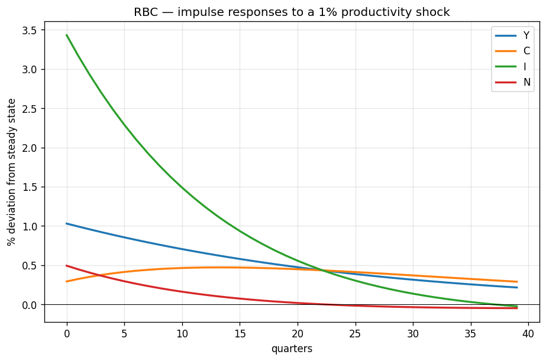
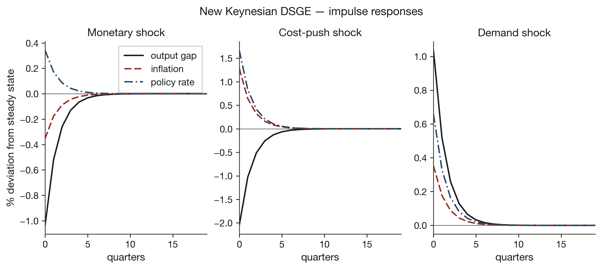
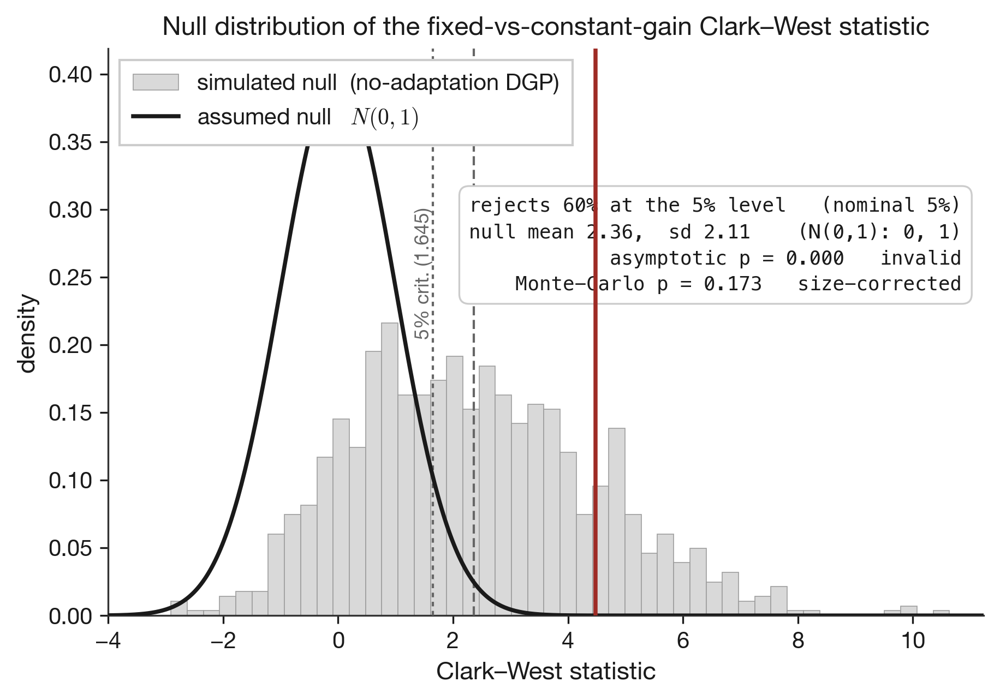

# Economic Evolution Lab (EEL)

A formalized, reproducible library of macroeconomic models — an RBC and a
three-equation New Keynesian DSGE — symbolically specified and solved by
first-order perturbation, with a swappable expectations operator and
size-calibrated out-of-sample evaluation. Motivated by making economic models
auditable in an era of advanced AI.

---

Economic models are commonly distributed as code whose assumptions and
derivations are hard to inspect, and whose forecast evaluations rely on
asymptotic results that need not hold for the methods being compared. This
repository formalizes a small set of macroeconomic models so that their structure
is explicit and reproducible. Each model's equilibrium conditions are specified
symbolically and solved to first order by the generalized Schur (QZ) method of
Klein (2000), with the steady state derived analytically and determinacy verified
through the Blanchard-Kahn condition; correctness is checked against the exact
closed-form solution where one exists (the δ=1 Brock-Mirman case), steady-state
identities, impulse-response signs, and business-cycle moments. The expectations
operator is defined as a swappable module, so that rational expectations and
Evans-Honkapohja adaptive learning can be compared within an otherwise identical
model. On this basis the repository asks whether belief adaptation improves
out-of-sample forecasting, and shows that constant-gain learning violates the
assumptions of the standard nested predictive-accuracy tests; the Clark-West and
Giacomini-White statistics are therefore calibrated by Monte Carlo against a
fixed-coefficient null, under which no robust improvement is found. The scope is
deliberately narrow: the object is the formalization, solution, and rigorous
evaluation of these models — not an operational system, and not a claim about
general artificial intelligence, which enters only as the motivating horizon for
making economic models auditable and, in future work, revisable by automated
agents.

## Contents

| Component | Path | Status |
|---|---|---|
| First-order perturbation engine (SymPy linearisation + Klein QZ) | `eel/solve/perturbation.py` | solved + tested |
| RBC — canonical, endogenous labour | `eel/models/macro/rbc.py` | solved + validated |
| New Keynesian three-equation DSGE | `eel/models/macro/nk_dsge.py` | solved + validated |
| Expectations operator (rational / adaptive learning) | `eel/expectations/learning.py` | swappable module |
| Forecast evaluation (Clark-West, Giacomini-White, MC size calibration) | `eel/evaluation/` | size-gated |
| Correctness + size-control tests | `tests/` | 32 passing |

The RBC is the template: declare a model symbolically (steady state + equilibrium
conditions) and the same engine linearises and solves it. The NK block reuses the
engine and adds the swappable expectations operator.

## How a model is solved

1. **Formalise.** The equilibrium conditions are written in SymPy. This is not
   decoration: SymPy differentiates them to build the (log-)linear system.
2. **Solve.** `A E_t w_{t+1} = B w_t` is solved by Klein's (2000) generalized
   Schur (QZ) method, yielding policy functions and a Blanchard-Kahn check.
3. **Validate.** Exact closed-form check (δ=1 ⇒ Brock-Mirman), steady-state
   identities, impulse-response signs, and business-cycle moments.

Impulse responses reproduce the textbook signatures of each model:





## Findings

**A methodological result.** Comparing a frozen ("fixed") forecast against a
constant-gain adaptive-learning forecast with the nested Clark-West test is
invalid as usually applied: constant gain carries non-vanishing estimation error,
so the statistic is systematically positive even when the data-generating process
has fixed coefficients and no adaptation. Under a fixed-coefficient null calibrated
to the data, the asymptotic one-sided 5% test rejects about 60% of the time. The
repository therefore calibrates the Clark-West and Giacomini-White statistics by
Monte Carlo against that null; the calibration is verified to restore correct size
(≈5% rejection, approximately uniform p-values).



**A substantive (null) result.** On a long out-of-sample split (train
1960Q1–1984Q4, evaluate 1985Q1–2019Q4, n=140) chosen to favour adaptation — the
Great-Inflation→Great-Moderation regime change falls at the train/holdout boundary
— constant-gain adaptation lowers one-quarter-ahead inflation RMSE by 6.2%, but the
size-correct test fails to reject the no-adaptation null (Monte-Carlo
p ≈ 0.17, in the range 0.15–0.17 across seeds, and stable across gains and
alternative nulls). The only size-correct
"significant" signal is a different and economically trivial contrast (discounting
versus equal weighting within a fixed memory window: +1.5% RMSE). The improvement
is not localized in the regime change but in the 2008–2019 period, and is
outlier-driven. In an earlier comparison, an apparent advantage of adaptive
learning over rational expectations was traced to relaxing the model's
cross-equation restrictions (structural misspecification), not to adaptation.

These are *failures to reject* at the available sample size, not proof that
adaptation cannot help. Full write-ups:
[`nk_phase2_findings.md`](experiments/nk_phase2_findings.md),
[`nk_phase2b_findings.md`](experiments/nk_phase2b_findings.md).

## Reproduce

```bash
python3 -m venv venv && source venv/bin/activate
pip install -e ".[dev]"                       # or: pip install -r requirements.txt

pytest -q                                     # 32 correctness + size-control tests
python -m eel.models.macro.rbc                # RBC: moments + IRFs  -> results/rbc_irf.png
python -m eel.models.macro.nk_dsge            # NK: determinacy + IRFs -> results/nk_irf.png
python -m experiments.nk_phase2b_adaptation   # size gate + adaptation study (~40s)
python -m experiments.fig_size_gate           # the size-calibration figure -> results/size_gate.png
```

Fixed seeds, pinned dependencies, config-driven runs. Requires Python 3.9+.
The committed FRED series are frozen vintage snapshots under `data/`, so the
empirical numbers reproduce despite later data revisions.

## Roadmap

- **Model zoo.** RBC and NK-DSGE are in; Solow and Merton follow the same recipe
  (symbolic formalisation → perturbation solution → validation).
- **Evaluation.** Extend the adaptation study with a larger / multi-country panel,
  where the output-gap result (a large but borderline magnitude) can be tested
  with more power.
- **Agent-assisted model auditing (future work, not built).** Agent-based and
  LLM-agent extensions in which model assumptions and institutions could be
  audited and, eventually, revised by automated agents — built on top of the
  validated zoo, never instead of it.

## Method

Symbolic formalisation → reproducible numerical solution → rigorous validation
(closed-form checks, moment matching, IRFs) → size-calibrated out-of-sample
evaluation. The governing principle is rigour before impression: a result that is
convincingly wrong is treated as harm, not a detail.

## Citation and licence

Metadata for citation is in [`CITATION.cff`](CITATION.cff) (GitHub renders a
"Cite this repository" button from it). Released under the MIT licence
([`LICENSE`](LICENSE)).
